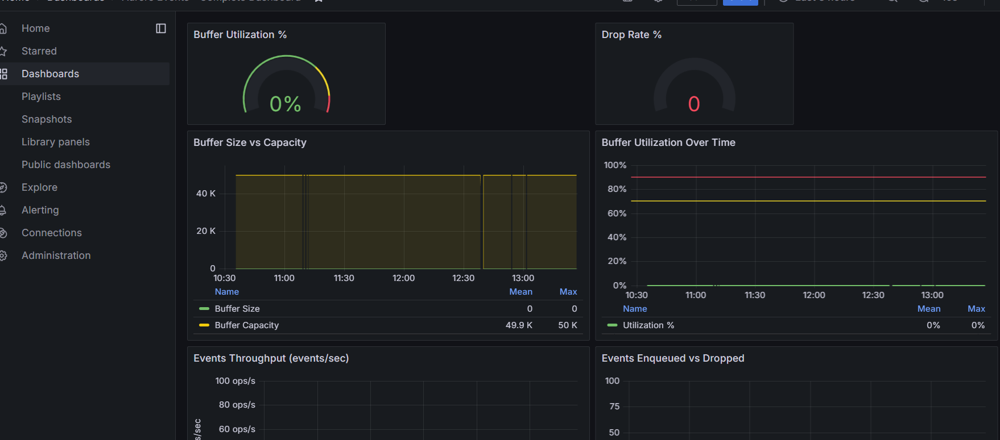

# Aurore Events MVP

Event System MVP for high-throughput event ingestion and querying.

## 🚀 Quick Start

**Requirements:** Node.js 18+, Docker Desktop

```bash
# 1. Install dependencies
npm install

# 2. Create .env file
cp env.example .env  # Linux/Mac
# Copy-Item env.example .env  # Windows PowerShell

# 3. Start PostgreSQL (Docker must be running!)
docker-compose up -d

# 4. Start the application
npm run start:dev
```

See [Installation](#installation) section for detailed steps.

## Features

- **High-Throughput Ingestion**: Handles ~300,000 events/minute (5,000 events/second) with in-memory buffering
- **Fast Queries**: Time-range and service-based queries with pagination
- **Automatic Retention**: 30-day automatic data cleanup
- **Resilient**: Graceful error handling, never breaks on bad events
- **Simple & Maintainable**: Built for junior developers
- **Security**: Input sanitization to prevent XSS attacks, comprehensive security tests
- **Rate Limiting**: Per-IP rate limiting to prevent abuse
- **Observability**: Prometheus metrics, Grafana dashboards, correlation IDs for request tracking, business metrics
- **Circuit Breaker**: Automatic protection against database failures
- **100% Decoupled Architecture**: All services use interfaces for complete decoupling
- **Comprehensive Testing**: 37 test files with 200+ test cases covering all components, including security tests
- **Dead Letter Queue (DLQ)**: Events that permanently fail are stored for manual review/reprocessing
- **Metadata Compression**: Automatic compression of large metadata (>1KB) to save storage space
- **Enhanced Health Checks**: Detailed health information including memory, database latency, and connection pool status

## Architecture

- **Ingestion API**: Fast HTTP endpoint for event ingestion
- **In-Memory Buffer**: Thread-safe queue to absorb spikes
- **Batch Worker**: Background processor for batch writes
- **Storage Layer**: PostgreSQL database with indexed queries
- **Retention Job**: Daily automated cleanup
- **Decoupled Design**: 100% of services use interfaces for complete decoupling
- **Comprehensive Testing**: Full test coverage with 37 test files

**📖 For detailed architecture documentation**, including class responsibilities, design patterns, data flow diagrams, and decoupling strategy, see:
- [`docs/ARCHITECTURE.md`](docs/ARCHITECTURE.md) - Complete architecture documentation
- [`docs/HOW_IT_WORKS.md`](docs/HOW_IT_WORKS.md) - Detailed system operation and data flow explanation

## Prerequisites

**Before starting, ensure you have:**

1. **Node.js 18+** installed ([Download](https://nodejs.org/))
2. **npm** (comes with Node.js) or **yarn**
3. **Docker Desktop** installed and running ([Download](https://www.docker.com/products/docker-desktop/))
   - ⚠️ **IMPORTANT**: Docker must be running before starting the application
   - Verify Docker is running: `docker ps` should work without errors

## Installation

**Follow these steps in order:**

```bash
# Step 1: Install Node.js dependencies
npm install

# Step 2: Create .env file from template
# On Linux/Mac:
cp env.example .env

# On Windows PowerShell:
Copy-Item env.example .env

# Step 3: Start PostgreSQL database with Docker
# Make sure Docker Desktop is running first!
docker-compose up -d

# Step 4: Verify PostgreSQL is running
docker-compose ps
# Should show: aurore-postgres | Up (healthy)

# Step 5: Build the project
npm run build
```

**⚠️ Important Notes:**
- Docker Desktop must be **running** before executing `docker-compose up -d`
- The `.env` file is **REQUIRED** - the application will fail without it
- All environment variables in `.env` are **REQUIRED** - no defaults are provided

**📖 Need help?** See [`docs/QUICK_START.md`](docs/QUICK_START.md) for a simplified 2-3 command setup, or [`docs/DOCKER_SETUP.md`](docs/DOCKER_SETUP.md) for detailed Docker and PostgreSQL configuration.

## Configuration

**⚠️ IMPORTANT**: All environment variables are **REQUIRED**. The application will fail to start if any are missing.

**📖 For detailed configuration guidance**, see [`docs/DOCKER_SETUP.md`](docs/DOCKER_SETUP.md).

Create a `.env` file from `env.example`:

```env
# Server Configuration (REQUIRED)
PORT=3000
HOST=localhost
NODE_ENV=development

# Database Configuration (REQUIRED - PostgreSQL only)
DB_HOST=localhost
DB_PORT=5432
DB_USERNAME=admin
DB_PASSWORD=admin
DB_DATABASE=aurore_events
DB_SYNCHRONIZE=true
DB_LOGGING=false
DB_POOL_MAX=20

# Batch Worker Configuration (REQUIRED)
BATCH_SIZE=5000
DRAIN_INTERVAL=1000
MAX_RETRIES=3
BATCH_MAX_SIZE=10000

# Buffer Configuration (REQUIRED)
BUFFER_MAX_SIZE=50000
CHECKPOINT_INTERVAL_MS=5000

# Retention Configuration (REQUIRED)
RETENTION_DAYS=30
RETENTION_CRON_SCHEDULE=0 2 * * *

# Query Configuration (REQUIRED)
DEFAULT_QUERY_LIMIT=100
MAX_QUERY_LIMIT=1000
MAX_QUERY_TIME_RANGE_DAYS=30
QUERY_TIMEOUT_MS=30000
MAX_QUERY_PAGE=10000

# Service Configuration (REQUIRED)
SERVICE_NAME_MAX_LENGTH=100
RETRY_AFTER_SECONDS=5

# Validation Configuration (REQUIRED)
MESSAGE_MAX_LENGTH=2000
METADATA_MAX_SIZE_KB=16
BATCH_CHUNK_SIZE=1000
METADATA_MAX_KEYS=100
METADATA_MAX_DEPTH=5

# Rate Limiting Configuration (REQUIRED)
THROTTLE_TTL_MS=60000
THROTTLE_GLOBAL_LIMIT=300000
THROTTLE_IP_LIMIT=10000
THROTTLE_QUERY_LIMIT=200
THROTTLE_HEALTH_LIMIT=60

# Circuit Breaker Configuration (REQUIRED)
CIRCUIT_BREAKER_FAILURE_THRESHOLD=5
CIRCUIT_BREAKER_SUCCESS_THRESHOLD=2
CIRCUIT_BREAKER_TIMEOUT_MS=30000
```

**Note:** This is a subset of the most important variables. See `env.example` for the complete list of all required variables, including additional configuration for shutdown, metrics, and query limits.

## Running the Application

**Before starting the application:**

1. **Ensure Docker Desktop is running**
2. **Ensure PostgreSQL container is running:**
   ```bash
   docker-compose ps
   # Should show: aurore-postgres | Up (healthy)
   ```
   
   If not running, start it:
   ```bash
   docker-compose up -d
   ```

**Then start the application:**

```bash
# Development mode (with hot reload)
npm run start:dev

# Or use the convenience script (starts Docker + app automatically)
npm run dev

# Production mode
npm run build
npm run start:prod
```

The API will be available at `http://localhost:3000`

**⚠️ Troubleshooting:**
- If you see connection errors, verify PostgreSQL is running: `docker-compose ps`
- If Docker is not running, start Docker Desktop first
- If the application fails to start, check that your `.env` file exists and has all required variables

## API Endpoints

### Ingest Event

**Linux/Mac (curl):**
```bash
curl -X POST http://localhost:3000/events \
  -H "Content-Type: application/json" \
  -d '{
    "timestamp": "2024-01-15T10:30:00.000Z",
    "service": "auth-service",
    "message": "User login successful",
    "metadata": {
      "user_id": "12345",
      "ip_address": "192.168.1.1"
    }
  }'
```

**Windows PowerShell:**
```powershell
$body = @{
    timestamp = "2024-01-15T10:30:00.000Z"
    service = "auth-service"
    message = "User login successful"
    metadata = @{
        user_id = "12345"
        ip_address = "192.168.1.1"
    }
} | ConvertTo-Json

Invoke-RestMethod -Uri http://localhost:3000/events `
    -Method POST `
    -ContentType "application/json" `
    -Body $body
```

**Note:** Metadata larger than 1KB is automatically compressed to save storage space.

**Response (202):**
```json
{
  "statusCode": 202,
  "message": "Event accepted"
}
```

**Response (429 - Buffer Full):**
```json
{
  "status": "rate_limited",
  "message": "Buffer is full. Please retry in a few seconds.",
  "retry_after": 5
}
```

### Query Events

**Linux/Mac (curl):**
```bash
curl "http://localhost:3000/events?service=auth-service&from=2024-01-15T00:00:00.000Z&to=2024-01-15T23:59:59.000Z&page=1&pageSize=50"
```

**Windows PowerShell:**
```powershell
$from = "2024-01-15T00:00:00.000Z"
$to = "2024-01-15T23:59:59.000Z"
$uri = "http://localhost:3000/events?service=auth-service&from=$from&to=$to&page=1&pageSize=50"
Invoke-RestMethod -Uri $uri -Method GET
```

**Response (200):**
```json
{
  "events": [
    {
      "id": "evt_abc123",
      "eventId": "evt_abc123",
      "timestamp": "2024-01-15T10:30:00.000Z",
      "service": "auth-service",
      "message": "User login successful",
      "metadata": {
        "user_id": "12345",
        "ip_address": "192.168.1.1"
      },
      "ingestedAt": "2024-01-15T10:30:01.000Z",
      "createdAt": "2024-01-15T10:30:01.000Z"
    }
  ],
  "pagination": {
    "total": 1250,
    "limit": 50,
    "offset": 0,
    "has_more": true
  }
}
```

### Business Metrics

**Linux/Mac (curl):**
```bash
curl http://localhost:3000/health/business
```

**Windows PowerShell:**
```powershell
Invoke-RestMethod -Uri http://localhost:3000/health/business -Method GET
```

**Response (200):**
```json
{
  "totalEvents": 123456,
  "eventsByService": {
    "user-service": 50000,
    "auth-service": 30000,
    "payment-service": 20000
  },
  "eventsLast24Hours": 5000,
  "eventsLastHour": 250,
  "averageEventsPerMinute": 3.47,
  "topServices": [
    { "service": "user-service", "count": 50000 },
    { "service": "auth-service", "count": 30000 }
  ],
  "eventsByHour": [
    { "hour": "2024-01-15 10:00", "count": 150 },
    { "hour": "2024-01-15 11:00", "count": 200 }
  ]
}
```

**Note:** Metrics are cached for 1 minute to reduce database load.

### Dead Letter Queue (DLQ)

**Linux/Mac (curl):**
```bash
# List events in Dead Letter Queue
curl "http://localhost:3000/dlq?service=auth-service&reprocessed=false&limit=100&offset=0"

# Get DLQ statistics
curl http://localhost:3000/dlq/statistics

# Get specific DLQ event
curl http://localhost:3000/dlq/:id

# Reprocess a DLQ event (re-enqueue to buffer)
curl -X PATCH http://localhost:3000/dlq/:id/reprocess

# Delete DLQ event permanently
curl -X DELETE http://localhost:3000/dlq/:id
```

**Windows PowerShell:**
```powershell
# List events in Dead Letter Queue
Invoke-RestMethod -Uri "http://localhost:3000/dlq?service=auth-service&reprocessed=false&limit=100&offset=0" -Method GET

# Get DLQ statistics
Invoke-RestMethod -Uri http://localhost:3000/dlq/statistics -Method GET

# Get specific DLQ event
Invoke-RestMethod -Uri http://localhost:3000/dlq/:id -Method GET

# Reprocess a DLQ event (re-enqueue to buffer)
Invoke-RestMethod -Uri http://localhost:3000/dlq/:id/reprocess -Method PATCH

# Delete DLQ event permanently
Invoke-RestMethod -Uri http://localhost:3000/dlq/:id -Method DELETE
```

**Response (list):**
```json
{
  "events": [
    {
      "id": "uuid-123",
      "eventId": "evt_abc123",
      "service": "auth-service",
      "failureReason": "Max retries (3) exceeded",
      "retryCount": 3,
      "lastAttemptAt": "2024-01-15T10:35:00.000Z",
      "reprocessed": false,
      "createdAt": "2024-01-15T10:35:00.000Z"
    }
  ],
  "total": 125,
  "limit": 100,
  "offset": 0
}
```

**Response (statistics):**
```json
{
  "total": 125,
  "byService": {
    "auth-service": 50,
    "payment-service": 75
  },
  "reprocessed": 10,
  "pending": 115,
  "oldestEvent": "2024-01-14T10:00:00.000Z"
}
```

### Health Check

**Linux/Mac (curl):**
```bash
curl http://localhost:3000/health
```

**Windows PowerShell:**
```powershell
Invoke-RestMethod -Uri http://localhost:3000/health -Method GET
```

**Response:**
```json
{
  "message": "SERVER_IS_READY"
}
```

Additional health endpoints:
- `GET /health/buffer` - Buffer status and metrics
- `GET /health/database` - Database connectivity, latency, and circuit breaker status
- `GET /health/detailed` - Complete system status (includes memory, database, buffer, circuit breaker, business metrics, uptime, environment info)
- `GET /health/business` - Business metrics and insights (event patterns, service usage, trends)

**Enhanced Health Check (`/health/detailed`) includes:**
- Memory usage (heap, RSS, external, usage percentage)
- Database query latency
- Connection pool information
- Overall system status (healthy/warning/critical/error)
- Uptime and response time
- Environment information (Node.js version, platform, PID)

## Project Structure

```
src/
├── main.ts                 # Application entry point
├── app.module.ts            # Root module
├── events/                 # Events module
│   ├── events.controller.ts
│   ├── events.module.ts
│   ├── dto/
│   │   ├── create-event.dto.ts
│   │   └── query-events.dto.ts
│   ├── entities/
│   │   └── event.entity.ts
│   ├── interfaces/
│   │   └── enriched-event.interface.ts
│   └── services/
│       ├── events.service.ts
│       └── event-buffer.service.ts
├── batch-worker/           # Batch processing module
│   ├── batch-worker.service.ts
│   └── batch-worker.module.ts
└── retention/             # Retention cleanup module
    ├── retention.service.ts
    └── retention.module.ts
```

## Testing

```bash
# Unit tests
npm run test

# E2E tests
npm run test:e2e

# Test coverage
npm run test:cov

# Load testing (single client)
npm run load-test [events_per_minute] [duration_seconds]

# Example: 5,000 events/minute for 60 seconds
npm run load-test 5000 60

# Parallel load testing (multiple clients)
npm run load-test:parallel [num_clients] [events_per_minute] [duration_seconds]

# Example: 15 clients, 20K events/min each = 300K events/min = 5,000 events/second
npm run load-test:parallel 15 20000 60
```

**Note:** All npm commands work identically on Linux/Mac/bash and Windows PowerShell. The examples above are platform-agnostic.

### Testing with PowerShell (Windows)

For manual API testing on Windows, you can use PowerShell:

**Send a test event:**
```powershell
$timestamp = (Get-Date).ToUniversalTime().ToString("yyyy-MM-ddTHH:mm:ssZ")
$body = @{
    timestamp = $timestamp
    service = "test-service"
    message = "Test event from PowerShell"
    metadata = @{
        test = "true"
        platform = "windows"
    }
} | ConvertTo-Json -Depth 3

Invoke-RestMethod -Uri http://localhost:3000/events `
    -Method POST `
    -ContentType "application/json" `
    -Body $body
```

**Query events:**
```powershell
$from = (Get-Date).AddHours(-1).ToUniversalTime().ToString("yyyy-MM-ddTHH:mm:ssZ")
$to = (Get-Date).ToUniversalTime().ToString("yyyy-MM-ddTHH:mm:ssZ")
$uri = "http://localhost:3000/events?service=test-service&from=$from&to=$to&page=1&pageSize=10"
Invoke-RestMethod -Uri $uri -Method GET | ConvertTo-Json -Depth 5
```

**Check health endpoints:**
```powershell
# Basic health check
Invoke-RestMethod -Uri http://localhost:3000/health

# Detailed health
Invoke-RestMethod -Uri http://localhost:3000/health/detailed | ConvertTo-Json -Depth 10

# Buffer status
Invoke-RestMethod -Uri http://localhost:3000/health/buffer | ConvertTo-Json -Depth 5

# Business metrics
Invoke-RestMethod -Uri http://localhost:3000/health/business | ConvertTo-Json -Depth 5
```

**📖 For detailed testing documentation**, including unit test coverage, testing strategy, and best practices, see:
- [`docs/TESTING.md`](docs/TESTING.md) - Complete testing documentation
- [`docs/TESTING_GUIDE.md`](docs/TESTING_GUIDE.md) - Step-by-step testing guide with examples

## Performance

- **Ingestion**: ~5,000 events/second (tested with parallel load tests)
- **Query Latency**: < 100ms (indexed queries)
- **Buffer Capacity**: 50,000 events (configurable via `BUFFER_MAX_SIZE`)
- **Batch Size**: 5,000 events per batch (configurable via `BATCH_SIZE`)
- **Database**: PostgreSQL 16 with connection pooling (max 20 connections)

**📖 For load testing documentation**, see [`scripts/README.md`](scripts/README.md) and [`scripts/README_PARALLEL.md`](scripts/README_PARALLEL.md).

## Error Handling

- **Invalid Events**: Logged and dropped (never break pipeline)
- **Buffer Full**: Returns 429/503 (soft backpressure)
- **Storage Failures**: Retry with exponential backoff (up to 3 retries)
- **Worker Crashes**: Auto-restart via process manager

**📖 For detailed error handling strategies and resilience patterns**, see [`docs/HOW_IT_WORKS.md`](docs/HOW_IT_WORKS.md) and [`docs/ARCHITECTURE.md`](docs/ARCHITECTURE.md).

## Retention

Events older than 30 days are automatically deleted daily at 2 AM. This is configurable via `RETENTION_DAYS` environment variable.

## Development

```bash
# Watch mode
npm run start:dev

# Debug mode
npm run start:debug

# Linting
npm run lint

# Format code
npm run format
```

## Production Deployment

1. Set `NODE_ENV=production`
2. Set `DB_SYNCHRONIZE=false` in `.env` (use migrations instead)
3. Configure PostgreSQL connection (update `DB_HOST`, `DB_PORT`, `DB_USERNAME`, `DB_PASSWORD`, `DB_DATABASE`)
4. Use process manager (PM2, systemd, etc.)
5. Set up database backups for PostgreSQL
6. Configure monitoring/alerting
7. Ensure all required environment variables are set (application will fail if any are missing)

## Docker Commands

**Linux/Mac/bash:**
```bash
# Start all services (PostgreSQL, Prometheus, Grafana)
docker-compose up -d

# Stop all services
docker-compose down

# View PostgreSQL logs
docker-compose logs postgres

# View Prometheus logs
docker-compose logs prometheus

# View Grafana logs
docker-compose logs grafana

# Access PostgreSQL console
docker-compose exec postgres psql -U admin -d aurore_events

# Check all services status
docker-compose ps
```

**Windows PowerShell:**
```powershell
# Start all services (PostgreSQL, Prometheus, Grafana)
docker-compose up -d

# Stop all services
docker-compose down

# View PostgreSQL logs
docker-compose logs postgres

# View Prometheus logs
docker-compose logs prometheus

# View Grafana logs
docker-compose logs grafana

# Access PostgreSQL console
docker-compose exec postgres psql -U admin -d aurore_events

# Check all services status
docker-compose ps
```

**Note:** Docker Compose commands work identically on all platforms. The examples above apply to both Linux/Mac and Windows PowerShell.

## Observability

The application includes **Prometheus** and **Grafana** for observability:

- **Prometheus**: Available at http://localhost:9090
  - Scrapes metrics from the application every 15 seconds
  - Stores metrics for 30 days
  - Metrics endpoint: `GET /metrics/prometheus`

- **Grafana**: Available at http://localhost:3001
  - Default credentials: `admin` / `admin`
  - **Complete Dashboard**: "Aurore Events - Complete Dashboard" with 16 panels covering all metrics
  - Dashboard automatically loaded via provisioning: `grafana/dashboards/aurore-dashboard.json`
  - Pre-configured Prometheus datasource
    


  


**All services start automatically** when you run `docker-compose up -d`.

**Note**: Prometheus metrics are exposed via `PrometheusService` and `PrometheusController` in the `CommonModule` (located at `src/modules/common/services/prometheus.service.ts` and `src/modules/common/controllers/prometheus.controller.ts`).

### Accessing Metrics

**Get Prometheus metrics from the application:**
```bash
# Linux/Mac
curl http://localhost:3000/metrics/prometheus
```

```powershell
# Windows PowerShell
Invoke-RestMethod -Uri http://localhost:3000/metrics/prometheus -Method GET
```

**Query Prometheus API (example: get buffer_size metric):**
```bash
# Linux/Mac
curl "http://localhost:9090/api/v1/query?query=buffer_size"
```

```powershell
# Windows PowerShell
$query = "buffer_size"
$uri = "http://localhost:9090/api/v1/query?query=$([Uri]::EscapeDataString($query))"
Invoke-RestMethod -Uri $uri -Method GET | ConvertTo-Json -Depth 10
```

**Open Prometheus/Grafana in browser (PowerShell):**
```powershell
# Open Prometheus
Start-Process "http://localhost:9090"

# Open Grafana
Start-Process "http://localhost:3001"
```

### Available Metrics

The application exposes the following Prometheus metrics:

- **Buffer Metrics**: `buffer_size`, `buffer_capacity`, `buffer_utilization_percent`, `events_enqueued_total`, `events_dropped_total`, `events_drop_rate_percent`, `events_throughput_per_second`, `buffer_health_status`
- **Batch Worker Metrics**: `batches_processed_total`, `events_processed_total`, `batch_processing_time_ms`, `batch_insert_time_ms`
- **Business Metrics**: `business_events_total`, `business_events_last_24h`, `business_events_last_hour`, `business_events_by_service`
- **Health Metrics**: `health_status`, `database_connection_status`, `circuit_breaker_state`
- **Infrastructure Metrics**: `process_cpu_user_seconds_total`, `process_resident_memory_bytes`, `nodejs_heap_size_total_bytes`

**📖 For detailed Docker setup and troubleshooting**, see [`docs/DOCKER_SETUP.md`](docs/DOCKER_SETUP.md).

## Recent Improvements (January 2024)

The following improvements have been implemented:

- ✅ **Dead Letter Queue (DLQ)** - Events that permanently fail after all retries are now stored in DLQ for manual review/reprocessing
- ✅ **Improved Retry Handling** - System now identifies specific events that fail instead of retrying entire batches
- ✅ **Metadata Compression** - Large metadata (>1KB) is automatically compressed to save storage space (50-70% reduction)
- ✅ **Enhanced Health Checks** - Health endpoints now include memory usage, database latency, connection pool info, and overall system status
- ✅ **Security Tests** - Comprehensive E2E security tests covering XSS, SQL injection, rate limiting, input validation, and more
- ✅ **Deployment Documentation** - Complete deployment guide with Docker, PM2, systemd configurations, backup procedures, and disaster recovery plan
- ✅ **Logger Improvements** - Replaced console.log with process.stdout.write for better control and performance

See `docs/RESUMEN_MEJORAS_IMPLEMENTADAS.md` for implementation details.

## Documentation

The project includes comprehensive documentation in the `docs/` folder:

### Core Documentation
- **`docs/ARCHITECTURE.md`** - Complete architecture documentation, class responsibilities, design patterns, and data flow diagrams
- **`docs/TESTING.md`** - Testing strategy, unit test coverage, E2E tests, and testing best practices
- **`docs/HOW_IT_WORKS.md`** - Detailed explanation of system operation and data flow

### Quick Start & Setup
- **`docs/QUICK_START.md`** - Quick start guide (2-3 commands to get started)
- **`docs/DOCKER_SETUP.md`** - Docker setup and PostgreSQL configuration guide
- **`docs/TESTING_GUIDE.md`** - Complete step-by-step testing guide with examples
- **`docs/DEPLOYMENT.md`** - Complete deployment guide for production environments

### Improvements Documentation
- **`docs/RESUMEN_MEJORAS_IMPLEMENTADAS.md`** - Summary of all improvements implemented
- **`docs/RESUMEN_POC.md`** - Quick summary for POC context
- **`docs/MEJORAS_CRITICAS_DETALLADAS.md`** - Detailed implementation guide for critical improvements (API Keys, Migrations, Backup) - for production, not POC

### Exercise Documentation (Aurore Labs Assignment)
- **`docs/part-a/`** - Part A: Design and MVP system architecture (7 documents)
  - [`docs/part-a/1-arquitectura-general-mvp.md`](docs/part-a/1-arquitectura-general-mvp.md) - General MVP architecture
  - [`docs/part-a/2-contrato-flujo-basico.md`](docs/part-a/2-contrato-flujo-basico.md) - Basic flow contract
  - [`docs/part-a/3-codigo-gestion-eventos.md`](docs/part-a/3-codigo-gestion-eventos.md) - Event management code
  - [`docs/part-a/4-decisiones-clave.md`](docs/part-a/4-decisiones-clave.md) - Key decisions
  - [`docs/part-a/5-mantenibilidad-equipo-junior.md`](docs/part-a/5-mantenibilidad-equipo-junior.md) - Maintainability for junior team
  - [`docs/part-a/6-plan-implementacion.md`](docs/part-a/6-plan-implementacion.md) - Implementation plan
  - [`docs/part-a/7-futuras-mejoras.md`](docs/part-a/7-futuras-mejoras.md) - Future improvements
- **`docs/part-b/`** - Part B: Mentoring and code review (with executable examples)
  - [`docs/part-b/README.md`](docs/part-b/README.md) - Part B overview
  - [`docs/part-b/MENTORING_CODE_REVIEW.md`](docs/part-b/MENTORING_CODE_REVIEW.md) - Code review examples
- **`docs/part-c/`** - Part C: Estimation and planning
  - [`docs/part-c/ESTIMACION_PLANIFICACION.md`](docs/part-c/ESTIMACION_PLANIFICACION.md) - Estimation and planning details
- **`docs/Practical Test - Aurore Labs - Emiliano L.pdf`** - Original assignment document

### Scripts Documentation
- **`scripts/README.md`** - Load testing documentation
- **`scripts/README_PARALLEL.md`** - Parallel load testing guide

## License

MIT
