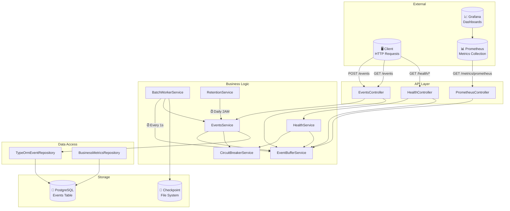
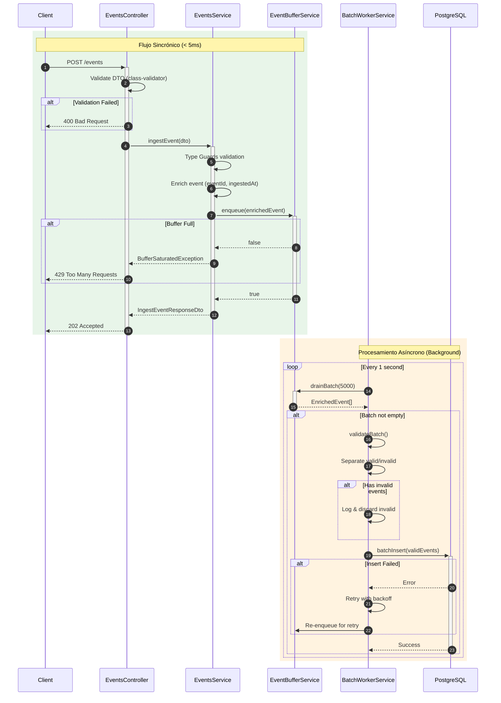
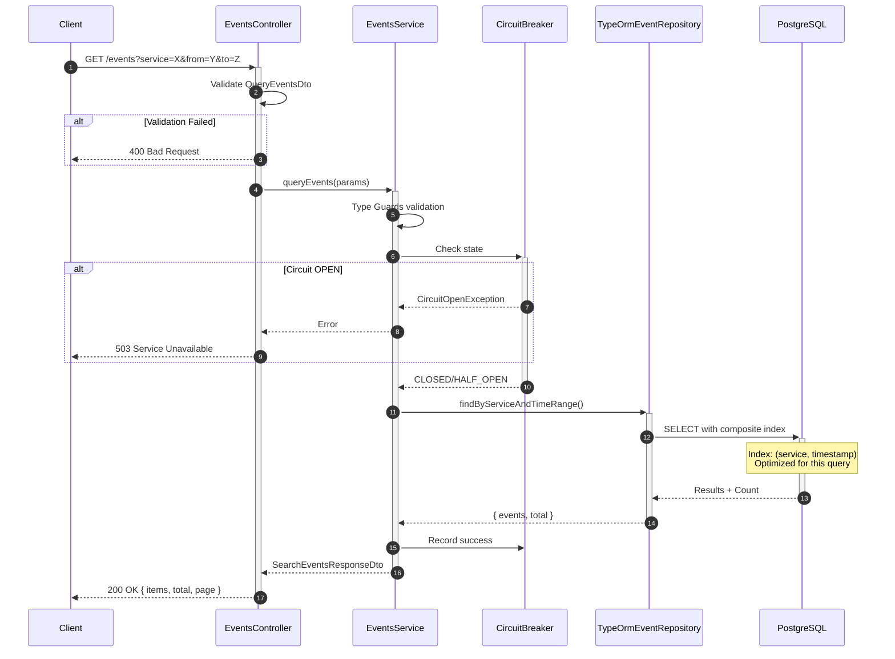
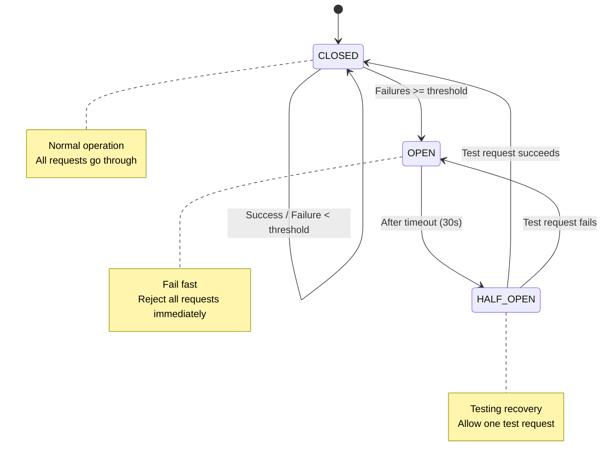
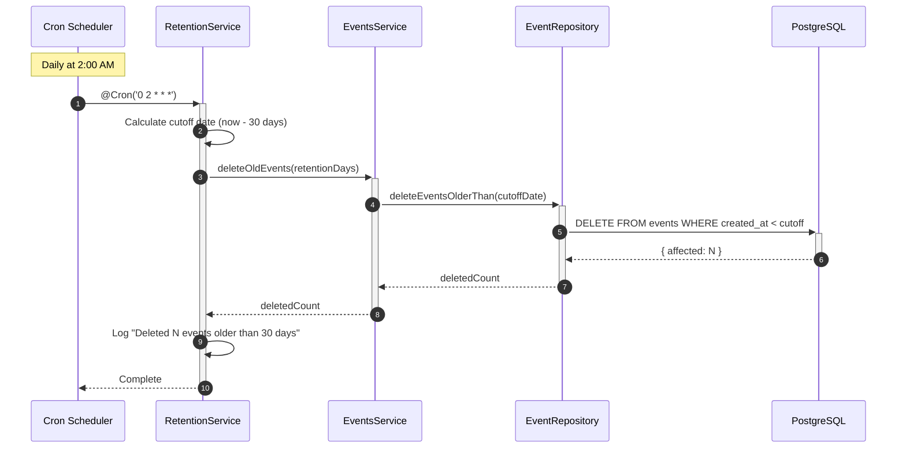

# Diagramas UML del Sistema

Este documento contiene los diagramas de secuencia y arquitectura del sistema de eventos.

---

## 1. Arquitectura de Componentes



---

## 2. Flujo de Ingesta de Eventos

Diagrama de secuencia mostrando el flujo completo desde que el cliente envía un evento hasta que se persiste en la base de datos.



---

## 3. Flujo de Consulta de Eventos

Diagrama de secuencia mostrando cómo se procesan las consultas con Circuit Breaker.



---

## 4. Estados del Circuit Breaker



---

## 5. Flujo de Retención Automática



---

## 6. Flujo de Dead Letter Queue (DLQ)

Diagrama mostrando cuándo y cómo los eventos fallidos se almacenan en DLQ para revisión y reprocesamiento manual.

```mermaid
sequenceDiagram
    autonumber
    participant Worker as BatchWorkerService
    participant ES as EventsService
    participant Repo as EventRepository
    participant DB as PostgreSQL
    participant DLQ as DeadLetterQueueService
    participant DLQDB as dead_letter_events

    Worker->>+ES: batchInsert(validEvents)
    ES->>+Repo: batchInsert(events)
    Repo->>+DB: INSERT INTO events (transaction)
    
    alt Insert Success
        DB-->>-Repo: Success
        Repo-->>-ES: insertedCount
        ES-->>-Worker: Success
    else Insert Failed (after max retries)
        DB-->>-Repo: Error (permanent failure)
        Repo-->>-ES: Error
        ES->>+DLQ: storeFailedEvent(event, error)
        DLQ->>+DLQDB: INSERT INTO dead_letter_events
        Note over DLQDB: Stores: event data,<br/>error message,<br/>failure timestamp
        DLQDB-->>-DLQ: Success
        DLQ-->>-ES: storedEventId
        ES-->>-Worker: Event stored in DLQ
        Worker->>Worker: Log "Event stored in DLQ for manual review"
    end
    
    Note over Worker,DLQDB: Events in DLQ can be:<br/>- Reviewed via GET /dlq<br/>- Reprocessed via PATCH /dlq/:id/reprocess<br/>- Statistics via GET /dlq/statistics
```

---

## Leyenda

| Símbolo | Significado |
|---------|-------------|
| 🖥️ | Cliente externo |
| 📊 | Sistema de monitoreo |
| 📈 | Visualización |
| 🐘 | Base de datos PostgreSQL |
| 💾 | Sistema de archivos |
| ⏰ | Proceso programado (scheduled) |
| `rect` verde | Flujo sincrónico |
| `rect` naranja | Flujo asíncrono |

---

## Notas

- Los diagramas usan [Mermaid](https://mermaid.js.org/), que GitHub renderiza automáticamente
- Para ver los diagramas localmente, usar extensión de VS Code o [Mermaid Live Editor](https://mermaid.live/)

---

## 🖼️ Cómo Ver los Diagramas Visualmente

### Opción 1: En GitHub (Más Fácil) ✅
1. Sube los archivos a GitHub
2. Abre `docs/DIAGRAMAS_UML.md` en GitHub
3. Los diagramas se renderizan automáticamente como gráficos

### Opción 2: Mermaid Live Editor (En el Navegador) 🌐
1. Ve a: **https://mermaid.live/**
2. Copia el código de un diagrama (por ejemplo, desde la línea 9 hasta la línea 72 del primer diagrama)
3. Pega el código en el editor
4. Verás el diagrama renderizado instantáneamente

**Ejemplo para el primer diagrama:**
- Copiar desde ````mermaid` hasta ```` (líneas 9-72)
- Pegar en https://mermaid.live/
- Ver el gráfico renderizado

### Opción 3: Extensión de VS Code 🔌
Instala una de estas extensiones en VS Code:

**Recomendada: "Markdown Preview Mermaid Support"**
1. Abre VS Code
2. Ve a Extensiones (Ctrl+Shift+X)
3. Busca: `Markdown Preview Mermaid Support`
4. Instala la extensión
5. Abre `docs/DIAGRAMAS_UML.md`
6. Presiona `Ctrl+Shift+V` (o `Cmd+Shift+V` en Mac) para ver el preview
7. Los diagramas Mermaid se renderizarán como gráficos

**Otras opciones:**
- `Mermaid Preview` - Preview dedicado para Mermaid
- `Markdown Preview Enhanced` - Preview avanzado con soporte Mermaid

### Opción 4: Visor de Markdown Online 📄
1. Ve a: **https://dillinger.io/** o **https://stackedit.io/**
2. Copia el contenido de `docs/DIAGRAMAS_UML.md`
3. Pega en el editor
4. Verás los diagramas renderizados

---

## 💡 Recomendación Rápida

**Para ver rápido sin instalar nada:**
1. Ve a **https://mermaid.live/**
2. Copia y pega el código de cualquier diagrama
3. Verás el gráfico al instante

**Para uso diario:**
- Instala la extensión `Markdown Preview Mermaid Support` en VS Code
- Presiona `Ctrl+Shift+V` cuando estés editando el archivo
